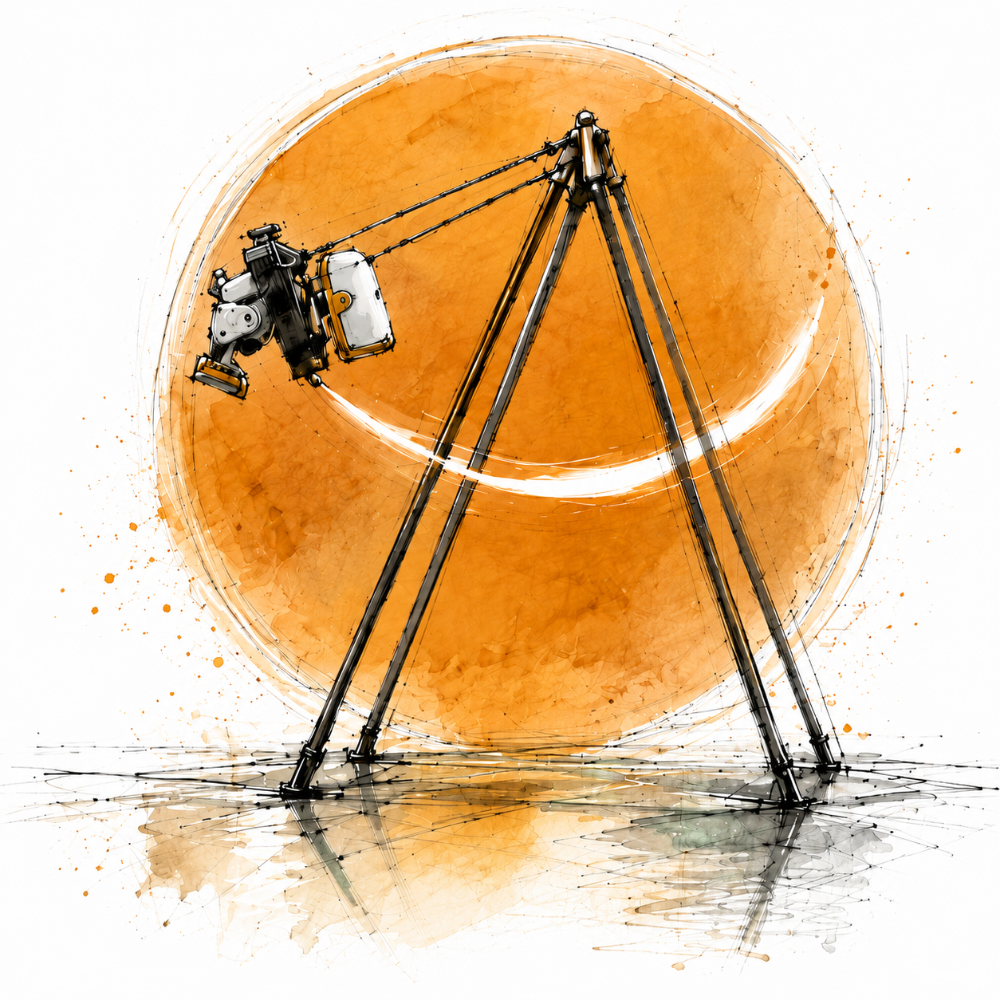
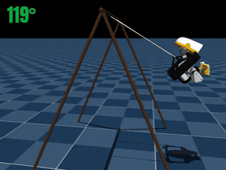
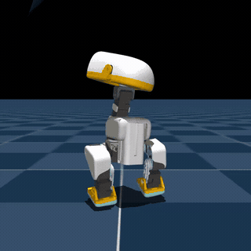
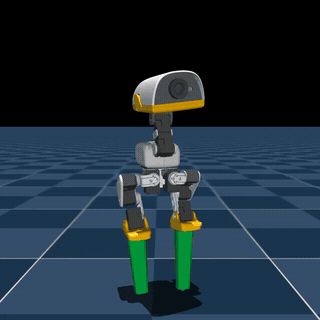
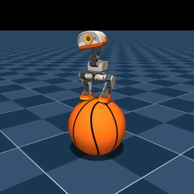
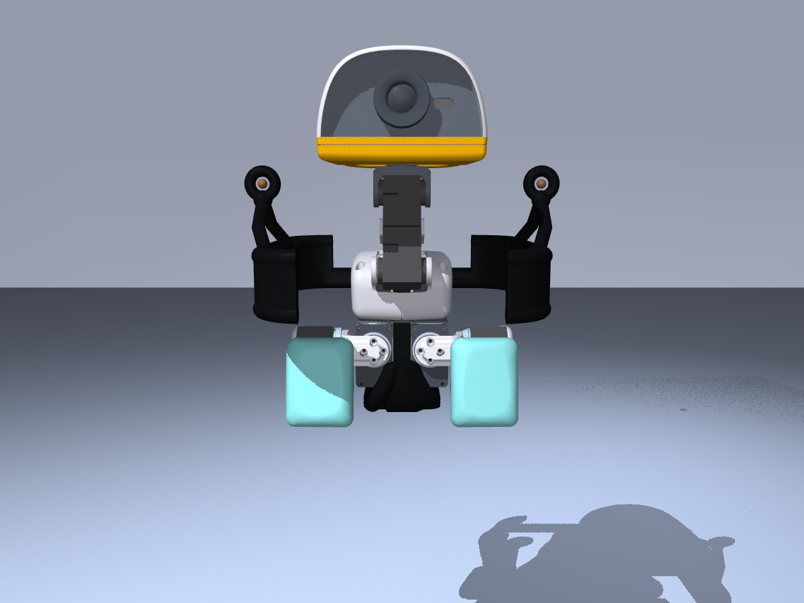
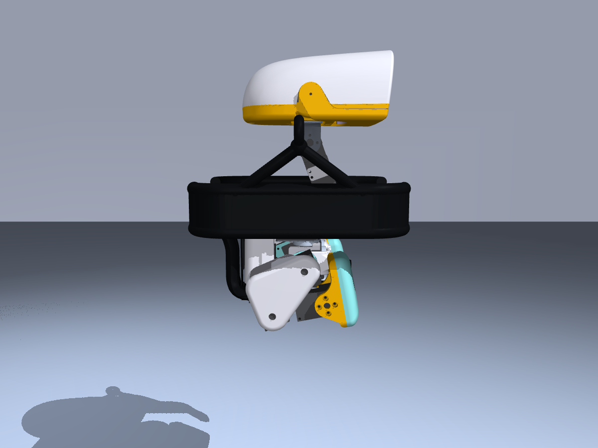

# Microduck Playground

[](https://github.com/Vottivott/microduck-playground/actions/workflows/ci.yml)



Reproducible reinforcement-learning experiments, policy demonstrations, and
printable hardware add-ons for
[Pollen Robotics' Microduck](https://github.com/pollen-robotics/microduck).

This is an independent experimental continuation of
[`pollen-robotics/microduck_rl`](https://github.com/pollen-robotics/microduck_rl),
not an official Pollen Robotics release. For the initial public release, all
playground-specific work is consolidated into one commit on top of upstream
commit [`d424a0c`](https://github.com/pollen-robotics/microduck_rl/commit/d424a0c899f6b33cbd3daeb279913134349c0b63),
preserving the original project history and attribution. Development after the
release uses ordinary commits. The upstream project can be added as a Git
remote when preparing focused contributions.

<br clear="right">

## Experiments

Animated previews play directly in the table. Click one—or use its explicit
full-video link—to open the complete silent MP4.

<table>
  <thead>
    <tr>
      <th>Experiment</th>
      <th>Preview</th>
      <th>Result and artifacts</th>
    </tr>
  </thead>
  <tbody>
    <tr>
      <td><strong>Self-pumped swing</strong></td>
      <td>
        <a href="experiments/swing/media/alpha050_seed27.mp4">
          
        </a>
      </td>
      <td>
        Starts still and reaches a 173.20° strict full span.<br>
        <a href="experiments/swing/media/alpha050_seed27.mp4">Full video</a> ·
        <a href="experiments/swing/README.md">Experiment</a> ·
        <a href="integrations/pollen-microduck/README.md">Runtime adapter</a> ·
        <a href="https://huggingface.co/HannesVonEssen/microduck-swing">ONNX on Hugging Face</a>
      </td>
    </tr>
    <tr>
      <td><strong>Fast running</strong></td>
      <td>
        <a href="experiments/running/media/preview.mp4">
          
        </a>
      </td>
      <td>
        Robustified iteration-12,195 simulation candidate: 1.651 m/s nominal,
        and 1.612 m/s under backlash plus disturbance stress.<br>
        <a href="experiments/running/media/preview.mp4">Full video</a> ·
        <a href="experiments/running/README.md">Experiment</a> ·
        <a href="https://huggingface.co/HannesVonEssen/microduck-running">ONNX on Hugging Face</a>
      </td>
    </tr>
    <tr>
      <td><strong>Stilt walking</strong></td>
      <td>
        <a href="experiments/stilts/media/preview.mp4">
          
        </a>
      </td>
      <td>
        Blend-0.50 policies for 10, 15, 20, 25, and 50 cm, plus
        1.0, 1.4, and 2.0 m simulation stilts (10 cm shown).<br>
        <a href="experiments/stilts/media/preview.mp4">Full video</a> ·
        <a href="experiments/stilts/README.md">Experiment</a> ·
        <a href="hardware/stilts/README.md">Hardware</a> ·
        <a href="https://huggingface.co/HannesVonEssen/microduck-stilts">Policies and videos</a>
      </td>
    </tr>
    <tr>
      <td><strong>Blind basketball balance</strong></td>
      <td><a href="experiments/basketball/media/preview.mp4"></a></td>
      <td>LSTM policy with no ball-state input: 97.01% survival over 60 seconds in 3,072 simulation trials. Experimental hardware-test candidate; hardware untested.<br>
      <a href="experiments/basketball/media/preview.mp4">Full video</a> ·
      <a href="experiments/basketball/README.md">Experiment and training</a> ·
      <a href="https://huggingface.co/HannesVonEssen/microduck-basketball">ONNX and checkpoint</a> ·
      <a href="https://github.com/pollen-robotics/microduck/pull/231">LSTM runtime PR</a></td>
    </tr>
  </tbody>
</table>

Each preview is a direct simulation demonstration of the policy linked in its
row. Compact machine-readable evaluation records live beside each experiment.

## Hardware galleries

The retained swing seat keeps the battery centered without occupying the
head-and-leg pumping corridors. It includes compliant locating pads, a padded
strap, and a removable buckle. The source generators, printable millimetre
meshes, MuJoCo collision hulls, and clearance reports are under
[`hardware/swing-seat`](hardware/swing-seat/README.md).

<table>
  <tr>
    <td align="center"><br><sub>Front</sub></td>
    <td align="center"><br><sub>Three-quarter</sub></td>
    <td align="center"><br><sub>Side</sub></td>
  </tr>
</table>

The stilt system replaces the removable soles and preserves explicit tip
contact geometry. The gallery uses the demonstrated green 10 cm blend-0.50
configuration. Parametric generators and printable meshes are under
[`hardware/stilts`](hardware/stilts/README.md).

<table>
  <tr>
    <td align="center"><br><sub>Front</sub></td>
    <td align="center"><br><sub>Three-quarter</sub></td>
    <td align="center"><br><sub>Side</sub></td>
    <td align="center"><br><sub>3D-printed prototype</sub></td>
  </tr>
</table>

## Quick start

A CUDA GPU and [`uv`](https://docs.astral.sh/uv/) are recommended. Training
uses MuJoCo Warp through `mjlab`.

```bash
git clone https://github.com/Vottivott/microduck-playground
cd microduck-playground
uv sync

# Cheap configuration/training smoke test first.
uv run train Mjlab-SwingPump-MicroDuck \
  --env.scene.num-envs 64 \
  --agent.max-iterations 5

# Full swing training configuration.
uv run train Mjlab-SwingPump-MicroDuck \
  --env.scene.num-envs 4096
```

## Repository layout

```text
experiments/
  basketball/            blind LSTM policy, evaluation, continuation guide
  running/               clean policy preview and result summary
  stilts/                policy index, executed curriculum, continuation guide
  swing/                 selected checkpoints, evaluation, media, methodology
hardware/
  stilts/                parametric stilt generator and printable meshes
  swing-seat/            retained-seat generator, meshes, clearance reports
src/mjlab_microduck/     tasks, robot models, actuator model, rewards
scripts/                 evaluation, export, rendering, and selection tools
integrations/            policy-specific deployment adapters
tests/                   CPU configuration and invariant tests
docs/                    supporting research and training notes
```

## Scope and safety

These are simulation experiments, not hardware safety certifications. The
swing model simulates two elastic tension-only cords and randomized actuator
and sensor dynamics, but real cord knots, frame flex, textile contact, servo
temperature, and assembly tolerances remain. Extreme-height stilts require an
engineered load path and fall protection. Use a safety tether, current limits,
an emergency stop, a clear exclusion zone, and conservative incremental tests.

## Upstream and contributions

To compare against or prepare a focused pull request for Pollen's project:

```bash
git remote add upstream https://github.com/pollen-robotics/microduck_rl.git
git fetch upstream
```

## License

Software is licensed under Apache-2.0; see [`LICENSE`](LICENSE). As in the
upstream project, 3D hardware design files are licensed under Creative Commons
Attribution-NonCommercial-ShareAlike 4.0 International; see
[`LICENSE-HARDWARE`](LICENSE-HARDWARE). Third-party Microduck assets retain
their original attribution and terms. See [`NOTICE`](NOTICE) and the
hardware-specific READMEs.
