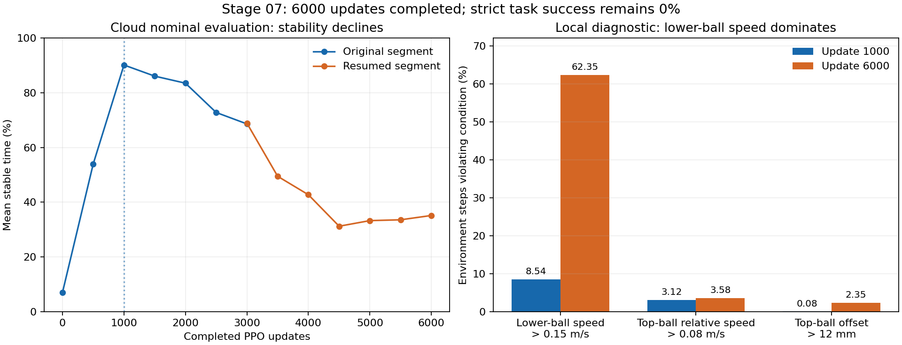
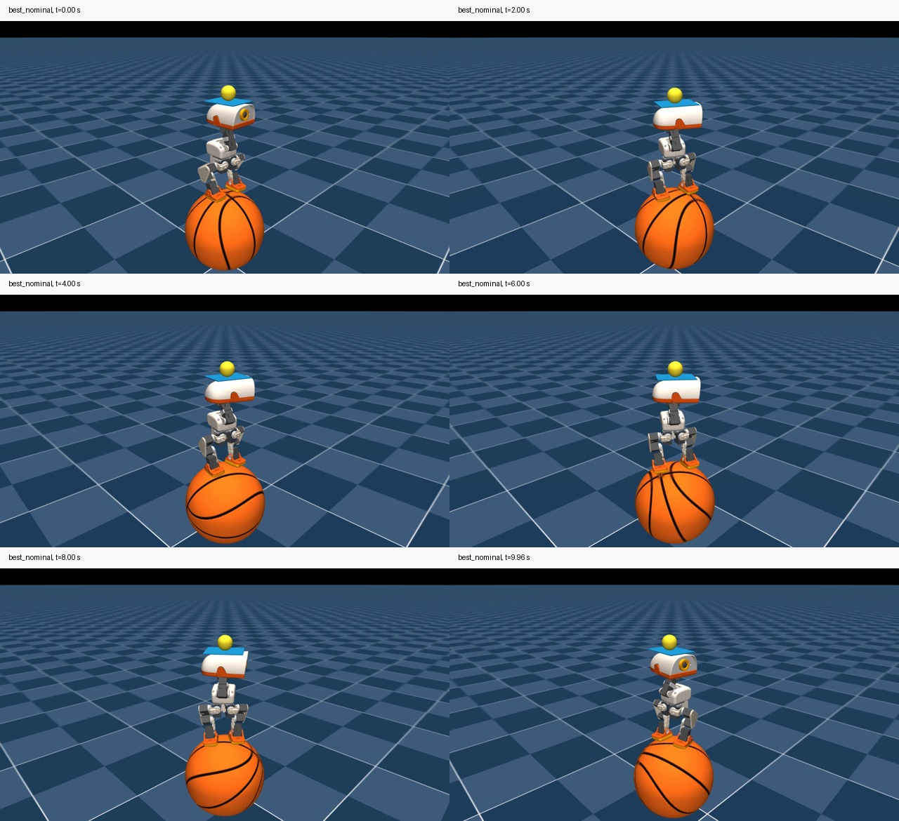
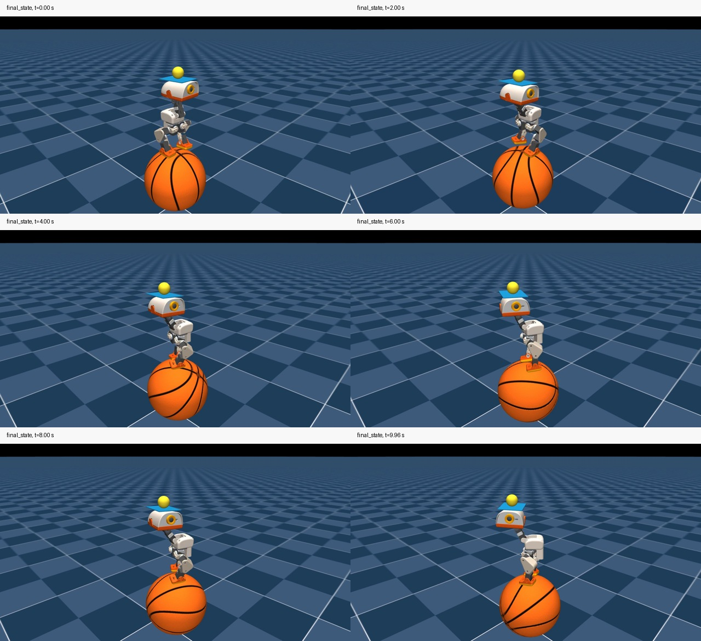

# Microduck Stage 07 云 GPU 辅助课程训练交接

证据复核日期：2026-09-28（北京时间）。本对话只处理 Stage 07。

**训练、评估、诊断、模型归档和交接工作已完成；严格双平衡策略目标未达标。**
工程验收与策略效果分开记录，不把 6000 次训练完成或日志 PASS 当作任务成功。
最后的 bundle 导入、`stage-07-complete` 注释标签和 SSH 推送在用户本机执行。
该标签表示本阶段实验封口，不表示已获得成功策略或完成实机部署。

## 1. 验收结论

| 项目 | 结果 |
|---|---|
| 初始化 | Stage 05 迁移检查点；未使用 Stage 06 smoke 或容量策略 |
| 云 GPU 容量 | A800 80GB，512/1024/2048/4096 四档实测 PASS |
| 正式训练 | A800，4096 环境，累计 6000 次 PPO 更新，TRAINING_COMPLETE |
| 数值与恢复 | finite_checks=PASS；断电后从 3000 次检查点显式恢复 |
| 云端名义评估 | 14 条记录均正常完成；严格成功率全部 0% |
| 最佳候选 | 原段第 1000 次，名义稳定时间 90.18%，存活 10 秒 |
| 最终模型 | 第 6000 次，名义稳定时间 35.16%，存活 10 秒 |
| 本机诊断 | 两例各 64 环境 × 10 秒，只推理；64,000 行轨迹核验 PASS |
| 视频 | 两段各 1280×720、25 fps、250 帧、10 秒；元数据、抽帧与轨迹联合检查 |
| 直接失败条件 | 下球平移速度超过冻结的 0.15 m/s 门限；打断连续稳定计时 |
| 文件归档 | 训练包及诊断包 SHA-256 通过；最佳/最终模型和视频已校验 |
| 冻结范围 | Stage 03 物理、Stage 04 任务/成功定义及依赖锁未修改 |
| 后续训练 | 不自动追加、不重跑 Stage 06 smoke；本阶段不执行 Stage 08 |

主验收文件：[stage-07-final-acceptance.json](../audits/stage-07-final-acceptance.json)。
完整云评估：[stage-07-nominal-evaluation-progress.json](../audits/stage-07-nominal-evaluation-progress.json)。
本机诊断：[stage-07-local-diagnostic.json](../audits/stage-07-local-diagnostic.json)。



左图为云端名义评估；右图为本机诊断中各条件违例的环境步比例，条件可能同时违例，
不能将各列相加解释为失败 episode 比例。

## 2. 基线、硬件及预算

- Stage 06 基线提交：`e3f26e3cbf633c70c75d4d073dbeb8c47c4f5bd1`。
- Stage 05 迁移提交：`c5b0aee66de10aa0c8aea0bdc85f1a917fada1df`。
- 正式训练源码提交：`2d10af503945f26f1d7364f19e4152eb540fb4d2`。
- Stage 06 的 64 环境 × 5 更新 smoke 和 254 passed / 2 skipped 回归沿用原验收，不重复运行。
- 正式训练设备：单张 `NVIDIA A800-SXM4-80GB`，81920 MiB。
- AutoDL SSH：`ssh -F /dev/null -p 26497 root@connect.bjb1.seetacloud.com`。
- 云端项目：`/root/autodl-tmp/microduck-double-balance/workspace`。
- 依赖：Torch 2.9.1+cu128、mjlab 1.3.0、MuJoCo 3.10.0、mujoco-warp 3.8.1、Warp 1.12.0、rsl-rl-lib 5.0.1。
- 本机 RTX 5060 Laptop GPU 仅用于后续 MuJoCo 推理/录制，没有用于正式 PPO 训练。

4096 环境容量实测峰值 23323 MiB、约 22342 transition/s、4.40 秒/更新，满足至少 15% 显存余量。
正式训练两段的已采样显存峰值最高为 23663 MiB。这里均为采样值，不保证捕获瞬时峰值。
容量记录见 [stage-07-cloud-capacity-summary.json](../audits/stage-07-cloud-capacity-summary.json)。

用户给定约 24 小时规划范围、允许小幅浮动、效果优先；没有 24 小时强制训练超时。
两段报告已记录的运行时间合计约 **8.21 小时**，包括启动、保存和评估，
不含部署/容量预检、关机间隔以及原段断电前未落盘的额外时间。未收到实际单价或账单，
不虚构人民币费用。曾因余额到期自动关机；后续无凭据的 SSH 断线没有被认定为再次断电。

## 3. 初始化、课程及恢复规则

初始化检查点 SHA-256：

`548758afc546e11d8f3f446a4bcc846283a669ff20f4048da7a3a7bb1332b98e`

本机来源：`/home/lx/microduck-double-balance/artifacts/double-balance-stage05/checkpoint.pt`。
云端来源：`/root/autodl-tmp/microduck-double-balance/artifacts/double-balance-stage05/checkpoint.pt`。

新训练严格加载 actor/critic/归一化器和迁移文件的空 Adam；源 iter=6999、common counter=168048
仅作为来源记录，Stage 07 更新/环境/物理计数归零，episode 年龄归零。初始 PPO 与 Adam LR 均为
`1e-3`，之后使用原 adaptive KL 调度；第一轮更新日志 LR 已降至 `1e-5`，末次为 `3.375e-5`。

辅助级别表保持 `[1, 0.5, 0.25, 0.1, 0.03, 0]`，每环境初始 level=0、hold=1；
存活达到 6 秒升级，短于 1.5 秒降级。上球始终自由。原奖励权重、命令和重心随机化课程
从 Stage 07 step 0 运行，不修改 Stage 03/04 文件。
末次辅助环境数为 `[1, 0, 16, 68, 234, 3777]`，即 92.21% 环境为零辅助；该比例不代表任务成功率。

恢复时保留权重、归一化器、Adam、实际 LR、累计更新和环境/物理计数以及逐环境辅助级别。
先在恢复的全局课程下重置 episode，再恢复辅助级别，避免被零年龄误降级。
模拟器状态、RNG、episode 和 LSTM rollout 隐状态重新开始，不承诺逐轨迹复现。
完成 N 次更新后保存 iter=N−1、common counter=N×24；目标数字是累计更新数。

| 训练段 | 日志更新范围 | 末次保存与说明 |
|---|---|---|
| `train-20260927T103517Z-3844` | 1–3087 | 末次保存 3000；余额到期断电，原报告历史状态仍为 RUNNING |
| `train-20260927T144559Z-1633` | 3001–6000 | 从原段 3000 恢复，最终 TRAINING_COMPLETE |

87 次更新因回退而重做。最终模型保留 6000 次更新、589,824,000 条采样转移；
实际日志执行 6087 次更新、598,376,448 条转移。原段历史 RUNNING 不表示另有训练仍在运行。

## 4. PPO 配置与评估口径

每次 rollout 为 4096×24=98,304 条转移；每次 PPO 更新 5 epochs × 4 minibatches。
gamma=0.99、lambda=0.95、clip=0.2、entropy_coef=0.01、desired_kl=0.01、max_grad_norm=1。
actor 为单层 256 维 LSTM 加 512/256/128 MLP，critic 为 512/256/128 MLP；均启用观测归一化。
接口保持 actor 61D、critic 85D、动作 14D。仿真步长 2 ms、decimation=10、控制周期 20 ms。

每 100 次保存，每 500 次独立严格加载评估，初始化/恢复时也评估一次；恢复的 3000 次重复记录保留。
评估使用冻结 play：64 个确定性名义初态副本、零命令、无辅助、无 DR/推力、10 秒 horizon。
这些副本不是独立随机任务试验，不据此宣称鲁棒性或泛化成功率。
成功要求 episode 末尾连续 5 秒全部满足瞬时条件，物理终止计失败。
过程 PASS 只说明评估正常结束。

候选排序固定为成功率、存活时间、稳定时间比例、较小中心误差；并列取较早模型。
`best.json` 仅覆盖单段，最终选择已经跨原段和恢复段比较。

## 5. 诊断结论及证据边界

诊断在本机既有环境对两个已校验 `.pt` 严格加载，没有 PPO 或参数更新。
每次在原 MetricsManager.compute 后、forward/reset 前观测；不重复调用有状态成功函数。
逐步合取与缓存稳定指标一致；汇总稳定比例、最长/末尾连续计时与原指标核对通过。
原始 64,000 行 CSV 已独立重新计算。两个模型的输入检查点均保持不变。

| 本机诊断指标 | 第 1000 次 | 第 6000 次 |
|---|---:|---:|
| 平均存活 | 10 秒 | 10 秒 |
| 稳定时间比例 | 90.08% | 35.03% |
| 最长连续稳定（所有副本中的最大值） | 2.34 秒 | 0.42 秒 |
| 曾经满足连续 5 秒 / 正式终局成功 | 0% / 0% | 0% / 0% |
| 下球速度超 0.15 m/s 的环境步比例 | 8.5375% | 62.3469% |
| 仅下球速度一项不合格 | 6.7250% | 59.9688% |
| 顶球相对速度超 0.08 m/s | 3.1188% | 3.5781% |
| 顶球水平偏差超 12 mm | 0.0844% | 2.3469% |
| 下球平均平移速度 | 0.06999 m/s | 0.17218 m/s |

其他门限（上下层高度、鸭身相对下球偏移、倾角和零辅助）在本次两例诊断没有违例。
下球速度是主要直接失败条件；顶球速度和位置偶发越界也会打断计时。
最长连续稳定远低于 5 秒，故不能归因于“只看最后一帧”或浮点计时阈值边界。

两段 env0 视频均为 10 秒完整首个 episode，未拼接不同 episode。
元数据经 ffprobe 核对；在 0、2、4、6、8、9.96 秒抽帧审查，
可见双足位于下球上、顶球仍在托盘上，伴随下球滚动和姿态/朝向变化。
128 个诊断 episode 全部只触发 time_out，完整轨迹支持没有摔倒/丢球终止。
单独观看跟随相机画面不能证明下球速度合格，应结合数值记录。





云端与本机的稳定比例略有差异；诊断硬件和渲染不同，不替换原云端正式评估。
尚未通过对照实验确定哪个奖励/课程参数导致退化。动作变化惩罚、训练命令分布、
DR 和课程变化可作为下一阶段假设，不能将相关性写成已证实因果。

## 6. 本机归档及模型用途

固定下载目录：`/home/lx/下载`；所有模型与视频均在 Git 仓库外。

| 下载归档 | SHA-256 |
|---|---|
| `microduck-stage07-results-20260927T190458Z-77jlku82.tar.gz` | `d4ef897f3dee5df531c6f2b9fb18e7c17aaf73f02b2fd762274d6d115a57bdec` |
| `microduck-stage07-diagnostic-qlekpq8r.tar.gz` | `96cf6d62644316fe880e5dd060b387b03172698917dc2127449f315c0d59b195` |

训练包含 124 项清单数据文件，另有 collection manifest；所有清单条目的大小与 SHA-256 已核验。
训练归档解包根目录：

`/home/lx/microduck-double-balance/artifacts/double-balance-stage07/microduck-stage07-results-20260927T190458Z-77jlku82`

该目录下：

- 最佳名义候选：`train-20260927T103517Z-3844/checkpoints/update_001000.pt`。
  SHA-256：`c667f96607b68383047f23956ba58805920434465245ef8e32d1148b17fc65b7`。
- 最终恢复状态：`train-20260927T144559Z-1633/checkpoints/update_006000.pt`。
  SHA-256：`a5ad0aedb500555b649c5d4b11aded833cbc0f932c1fff1a747e1492534c495c`。

诊断根目录：

`/home/lx/microduck-double-balance/artifacts/double-balance-stage07/diagnostic-qlekpq8r`

其 `best_nominal/` 与 `final_state/` 分别包含 `diagnostic.json`、`trace.csv.gz`、`env0.mp4` 和配置。
不要把第 6000 次默认当作更好的策略；第 1000 次是候选基线，也没有通过严格任务目标。
其他周期 `.pt` 和 TensorBoard 事件仍保留在云端，未全部回传，不声称完整备份了这些大文件。
本阶段自动 ONNX 导出发生过 LSTM 动态 batch 警告，未进行 Stage 07 ONNX runtime parity/实机部署验收；
接受的研究制品为上述 `.pt`，后续部署仍须使用含观测归一化器的正式导出路径。

用户要求适时提醒关机；归档验证后已明确提醒可在 AutoDL 关机，并保留实例和数据盘。
本阶段交接不再需要云端作业。实际关机尚未收到用户确认，不声称已代操作关闭。

## 7. 代码验证与本机封口

Stage 07 正式/容量工具的 CPU 定向测试为 19 项，收集工具 6 项，诊断计时汇总 3 项。
实际云端训练/恢复/保存重载/评估和实际本机诊断已经运行，不以静态检查替代这些证据。
本次没有重跑 Stage 06 smoke，也未将 Stage 06 的全量回归数量改称本次 Stage 07 回归。
本机封口脚本只校验现有归档、来源与 Git 状态并创建注释标签，不启动训练或下载依赖。

始终遵守 [本机提交与 SSH 推送固定规范](microduck-local-ssh-push-protocol.md)。
本机仓库 `/home/lx/microduck-double-balance/workspace`，分支 `double-balance`，
origin 为 `git@github.com:liuxue-lab/microduck-double-balance.git`。

1. 下载本次最终 bundle 到 `/home/lx/下载`，核对交付消息中的 SHA-256。
   为避免旧版同名缓存，下载别名带本次提交短号，再复制到固定名 `microduck-stage-07-from-stage-06.bundle`。
2. `git bundle verify`；fetch 到 `refs/remotes/stage07/double-balance`；切换本地分支并 `merge --ff-only`。
   不直接 fetch 到当前检出分支，不 force push。
3. 在本机运行 `bash scripts/finalize_stage07_local.sh`。脚本校验两个下载包、两个模型、
   视频与诊断记录、冻结路径和工作树，然后在本机创建 `stage-07-complete` 注释标签。
   若同名标签已存在，只有其类型为 tag 且指向当前 HEAD 才接受，不覆盖不同标签。
4. 用户在同一个本机终端执行 `git push origin double-balance` 和 `git push origin stage-07-complete`。
   正常成功输出即足够，不重复完整远端核验。仅异常时排查。

## 8. 下一对话的边界与建议

原路线的 Stage 08 为撤除辅助、正式训练和批量评估。本次已多数撤辅助，但静止双重平衡目标未达标，
下一阶段应先利用上述证据修正训练方案，不能仅从最终 6000 次盲目追加更新。
默认候选参考为第 1000 次；是否保留 Adam/LR、全局课程和辅助计数，必须在新实验开始前明确记录。
优先围绕下球低速保持与训练命令/奖励关系设计小规模、可比较的对照，再讨论扩大训练。
任何 Stage 03/04 物理、奖励/任务或成功门限变更须先解释并获得相应授权，不能为提高数字放宽门限。

可复制到新对话：

```text
继续 Microduck 双重平衡项目，本对话只处理 Stage 08。
读取 docs/handoffs/microduck-stage-07-cloud-assisted-training-handoff.md、
docs/audits/stage-07-final-acceptance.json、docs/audits/stage-07-local-diagnostic.json，
以及 docs/handoffs/microduck-local-ssh-push-protocol.md。
Stage 07 已完成 A800 4096 环境、累计 6000 次训练及归档诊断，但严格成功率为 0%。
最佳候选为原段第 1000 次，最终第 6000 次发生退化。主要直接失败条件是下球速度超 0.15 m/s；
本机诊断最长连续稳定仅 2.34/0.42 秒，未达到 5 秒，不能将阶段封口当作策略成功。
先核对本机 stage-07-complete 标签和证据，再制定纠偏对照与 Stage 08 方案。
正式训练只用云 GPU，本机用于代码和 MuJoCo 推理；不要重跑 Stage 06 smoke，
不要盲目继续第 6000 次模型，不擅自修改 Stage 03/04 或成功门限。
沿用固定下载目录、本机注释标签和 SSH 推送规范；正常推送后不重复完整远端核验。
```
