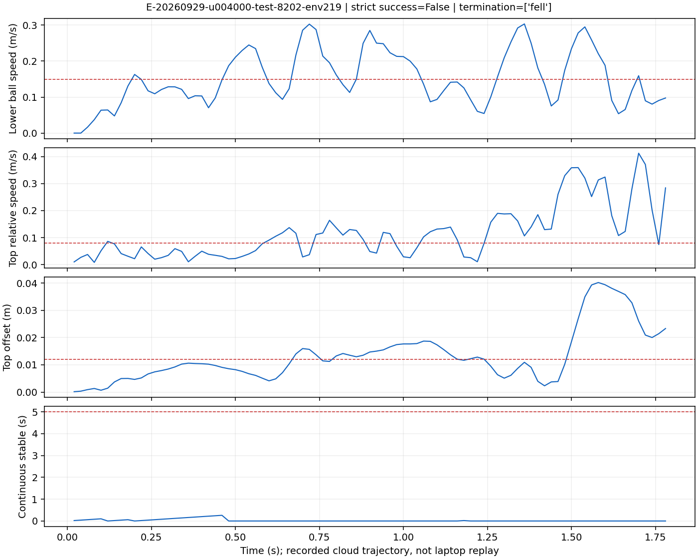
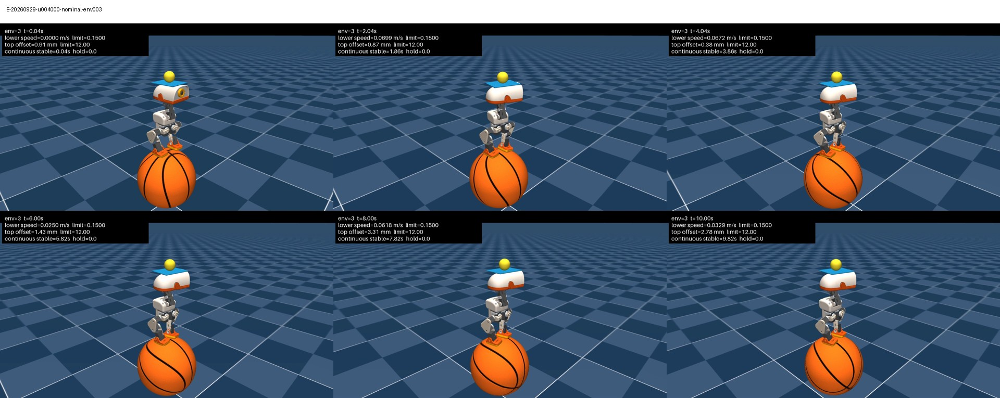

# Microduck Stage 08：辅助撤除、训练纠偏与批量评估交接

证据复核：2026-09-30，北京时间。本对话仅处理 Stage 08。

**本阶段训练、独立评估、失败分析、视频抽样审查及必要文件回传已经完成。主模型严格成功率为 652/768（84.90%），仍有失败回合和持续偏头问题。** 本交接不把评估程序 PASS、训练进度 100% 或阶段完成标签解释为策略全面达标。最终代码导入、注释标签和 SSH 推送仍需在用户本机完成。

## 1. 当前结论与下一步边界

- Stage 07 两个参照模型在本次共同独立初态集上均为 0/768。
- Stage 08 三个 E 组候选分别为 577/768、652/768、586/768；出现可复核的严格无辅助成功回合。
- 主展示模型 E/20260929/u4000 在查看独立测试前已按开发集选定，未用测试集重选模型。
- 仍有 116/768 个主模型失败回合，其中 1 个因 `fell` 终止；不能宣称稳定可靠地完成所有初态。
- 视频中最终候选持续偏头。现有目标没有要求头朝向躯干正前方，该问题未解决，未通过修改阈值或重解释指标消除。
- 无新增训练计划。任何新增姿态目标、奖励或 Stage 03/04 修改，先给用户具体方案和影响，由用户确认。
- 云端必要工作及文件回传已核验；后续封口操作均在本机。实际 AutoDL 关机尚未收到用户确认。

主验收：[stage-08-final-acceptance.json](../audits/stage-08-final-acceptance.json)。
原始独立测试汇总：[stage-08-final-evaluation-review.json](../audits/stage-08-final-evaluation-review.json)。
失败分析：[stage-08-failure-analysis.json](../audits/stage-08-failure-analysis.json)。
视频审查：[stage-08-video-review.json](../audits/stage-08-video-review.json)。

## 2. 基线、硬件与冻结范围

| 项目 | 内容 |
|---|---|
| Stage 07 提交 | `1fe5f54dc467205b846a807f2bd494c46f3e2c40` |
| 本阶段正式运行源码 | `61060f0684aabb460727a0d226b8d17225ee7954` |
| 分支 | `double-balance` |
| Campaign | `08b6a999-c815-4afc-a99a-b6ac07fd587f` |
| 最终云实例 | `root@connect.bjb1.seetacloud.com:41381`，RTX 5090，32607 MiB |
| 本机 | RTX 5060 Laptop 8 GiB，仅代码、CPU 分析、MuJoCo 推理和视频 |
| 正式训练 | 4096 环境，24 步/更新，98304 transitions/更新 |
| 仿真 | 物理步长 0.002 s，控制步长 0.02 s，episode 10 s |
| 版本 | Torch 2.9.1+cu128、mjlab 1.3.0、MuJoCo 3.10.0、mujoco-warp 3.8.1、Warp 1.12.0、rsl-rl-lib 5.0.1 |
| 冻结内容 | Stage 03 物理、Stage 04 任务及严格成功定义、依赖锁均未改变 |

Stage 07 分支与 `stage-07-complete` 已由用户确认正常 SSH 推送，不重复完整远端核验。未重跑 Stage 06 smoke。A800 沿用旧容量证据；5090 曾独立测得 D/E 峰值显存 22837 MiB，平均 2.78/2.61 秒/更新，正式运行约 2.5–3.1 秒/更新。这些是测量结果，不是恒定性能保证。

预算最终采用 5090 60 小时方案，A800 24 小时是替代方案，不相加。部署自动记录的累计起点跨实例迁移保留，没有因克隆或重试重置。2026-09-30 15:41:15 的只读快照累计 23.738 小时、余额 36.262 小时；独立评估准入估计含裕量 1.1 小时。18,000 次更新数不是实际计费时长。未取得最终账单及真实关机时间，不虚构总费用或已停止计费。

## 3. 训练目标审查与实验设计

Stage 07 第 1000 次候选优于第 6000 次最终状态，但两者严格成功率为零。直接观测失败条件主要是下球平面速度超过 0.15 m/s。审查同时发现训练命令、动作变化课程、重心随机化课程及残余辅助与严格静止无辅助评估存在分布差异。这些事实不能单独证明哪一项导致退化。

首轮采用逐层增加覆盖的嵌套对照，而非一次改动所有奖励：

| 组 | 相对前组增加的训练覆盖 |
|---|---|
| A | 继承 Stage 07 原训练设置 |
| B | 三轴 twist 范围归零，standing=1，turn-in-place=0，移除 standing 课程 |
| C | 在 B 基础上固定动作变化权重 -0.4，移除该权重课程 |
| D | 在 C 基础上固定躯干/头部重心随机化 ±0.005 m，移除对应课程 |
| E | 在 D 基础上彻底撤除辅助：所有 level=5、hold=0，移除辅助课程，清零并检查球与鸭身施加力/力矩 |

阶段初始方案、证据与假设完整保留在 [stage-08-execution-plan.md](../audits/stage-08-execution-plan.md)。该文件的“尚未运行”是历史状态；本交接与最终验收文件是当前状态。

筛选 E 组第 500 次在 nominal 为 17/64、dev 为 32/128，预定复核门槛仅 E 通过。后续用 D/E 三个种子复核：D 的 dev 第 1500 次成功数为 0/1/0，E 为 79/87/35（分母均 128）。这支持在 D 其余设置下采用明确零辅助的 E 配方；不证明奖励、命令、重心和辅助之间不存在交互，也不说明偏头由撤辅助造成。

## 4. 检查点初始化与恢复规则

共同源模型为 Stage 07 第 1000 次：

`c667f96607b68383047f23956ba58805920434465245ef8e32d1148b17fc65b7`

Stage 07 第 6000 次仅作为评估参照，没有从其盲目追加训练。

| 状态 | 新实验从源 1000 分支 | 同实验继续训练 |
|---|---|---|
| actor/critic/归一化器 | 严格完整加载 | 严格完整加载自己的检查点 |
| Adam | 保留源状态，step=20000 | 保留自己的 Adam 状态，不重置 |
| 学习率 | 恢复源实际值约 2.25e-5，继续原 adaptive KL | 恢复所选续训端点的实际值，不回退初始值 |
| 实验更新数 | 0 | 继续检查点实验累计数 |
| 血统更新数 | 1000 | 1000 + 实验累计数 |
| common/sim counter | 24000 / 240000 | 血统更新数 ×24 / ×240 |
| 辅助状态 A–D | 恢复源逐环境 level/hold | 恢复本组逐环境 level/hold |
| 辅助状态 E | 强制 level=5、hold=0；清零并核验所有辅助 wrench | 同样强制为零，禁止辅助自动回升 |
| simulator / episode / RNN rollout 状态 | 重新开始，episode 年龄归零 | 重新开始；不声称逐轨迹续接 |
| RNG | 按本实验种子初始化，不恢复模拟器随机轨迹 | 不承诺完整 RNG/模拟器轨迹连续性 |

实验种子为 20260928、20260929、20260930。每 100 次保存，每 250 次评估并保存。所有组共用固定初态和原严格评估工厂。源策略共享，因此三个种子是三次微调复核，不是从三个独立随机网络开始。

| 批次 | 实际新增更新数 | 规则 |
|---|---:|---|
| 筛选 | 2500 | A–E 各从源 1000 新建，训练 500 |
| 复核 | 8000 | D/E 的 20260928 从各自 500 续至 1500；另两种子从源 1000 各训练 1500 |
| 延伸 | 7500 | 三个 E 种子分别从自己的 1500 续至 4000，各新增 2500 |
| 合计 | 18000 | 1,769,472,000 条正式新采样转移；容量测试不计入 |

“4000”是每个 E 实验的累计更新目标，“7500”是三个种子合计新增量，两者口径不同。延伸起点的 Adam step=50000、common/sim counter=60000/600000；恢复各自实际学习率，未统一重置。

A 筛选原段完成 500 次后，GPU 遥测 `nvidia-smi` 超时导致最终状态 FAIL，但模型及评估已经保存。修复后以 A 的 500 端点恢复收尾，额外 PPO=0；原 FAIL 记录保留，不把重收尾算作第二次 500 更新。完整分段及身份见 [stage-08-extension-review.json](../audits/stage-08-extension-review.json)。

## 5. 模型选择与独立评估

按预定 dev/nominal 排名规则，每个 E 种子选择一个最佳检查点；依次优先 dev 成功率、nominal 成功率、dev 存活、终局稳定中位数、最长稳定中位数、较低下球违例率及较早更新数。未直接采用三个最后端点。

| 种子 | 选中实验更新 | 检查点 SHA256 |
|---|---:|---|
| 20260928 | 2750 | `42e759a80626859aa6756bec81e3fd07e53845a4ec7ef1a56f5054fd3dfacd1f` |
| 20260929 | 4000 | `86d55c3703c18fcf4817db49c6e4dcf839b3f5195d68ae2c559db7e222bded97` |
| 20260930 | 3250 | `89c7cedb9567f144228deb4d98465a9b0aad08be9f7c3ad391aa6a12ade8431c` |

选择文件于 2026-09-30 15:56:54 冻结，SHA256 为 `a921801927750f705075ebcb2048323b01413bd122b31d1472dc77f86e1eb031`。随后执行 5 个模型 ×5 协议，16:11:58 完成 25/25，程序均 PASS。

协议为 nominal 64、dev 128，以及独立 test-8201/8202/8203 各 256。nominal 是名义初态副本，不能据此给独立随机泛化置信区间；dev 已用于选择。每个模型的 768 个测试初态相同，不能把三个模型的结果合并为 2304 个独立试验。测试只随机初始位置/朝向/关节等重置条件，没有物理随机化或外推力。

| 模型 | nominal | dev | 独立成功数 | 成功率 | Wilson 95% | 终局稳定中位 s | 下球违例占比 |
|---|---:|---:|---:|---:|---:|---:|---:|
| E/20260928/u2750 | 48/64 | 95/128 | 577/768 | 75.13% | 71.95–78.06% | 8.24 | 1.96% |
| E/20260929/u4000 | 49/64 | 109/128 | 652/768 | 84.90% | 82.19–87.25% | 8.91 | 1.36% |
| E/20260930/u3250 | 49/64 | 102/128 | 586/768 | 76.30% | 73.17–79.17% | 8.51 | 1.92% |
| source-1000 | 0/64 | 0/128 | 0/768 | 0.00% | 0.00–0.50% | 0.14 | 9.90% |
| reference-6000 | 0/64 | 0/128 | 0/768 | 0.00% | 0.00–0.50% | 0.00 | 62.21% |

表中 nominal/dev 为最终重评，可能与选择时的原分数不同；GPU 浮点轨迹差异没有被用来重选。区间是每个冻结模型在此初态分布上的 Wilson 95% 区间。三个种子成功率均值 78.78%，不等于主模型的 84.90%。未预先指定总体成功率门槛，不事后发明一个门槛宣布完全达标。

## 6. 严格成功与失败分析

沿用原 Stage 04：10 秒首回合终局必须连续稳定至少 5 秒，期间顶球偏移 ≤12 mm、高度偏差 ≤6 mm、相对速度 ≤0.08 m/s；下层偏移 ≤6 cm、根部高度 0.20–0.29 m、躯干倾角 ≤20°、下球平面速度 ≤0.15 m/s，且无辅助。物理终止判失败。不是“任意时段曾经连续成功过 5 秒”。

| E 模型 | 失败数 | 曾经连续 ≥5 s 但终局失败 | 最后不稳定样本包含下球速度违例 | 物理终止 |
|---|---:|---:|---:|---:|
| 20260928/u2750 | 191 | 99 | 189 | 0 |
| 20260929/u4000 | 116 | 70 | 115 | 1 |
| 20260930/u3250 | 182 | 110 | 182 | 0 |

20260928 另外 2 个失败最后违例为上球相对速度。主模型的 1 个跌倒案例在最后样本同时违反上球位置/速度、下层位置/高度与倾角。表中违例可重叠，只说明直接观测到的计时打断条件，不是“某项奖励导致失败”的因果证明。

主模型 `test-8202/env219` 在 1.78 秒触发 `fell`，最长稳定 0.26 秒，下球最高速度 0.30343 m/s。原始 state ID 为 `06439a1432fc484c4aa58cdd61249d6fa4e5930b4b1d0e8048ec4603cb120f24`。这是云端原轨迹的数值证据；本机 nominal 视频没有重新呈现该独立测试跌倒，不能把别的视频冒充它。



## 7. 视频检查与偏头问题

本机渲染于 2026-09-30 18:01:58–18:06:36 完成，RTX 5060，仅推理，PPO 新增 0。9 段视频均为 1280×720、25 fps、250 帧、10 秒。包内 52 个文件经 SHA256/尺寸验证，检查点、报告、初态身份一致。

本次审查查看 9 张各 6 帧联系表，共 54 个时刻，结合元数据和指标；没有声称逐帧或接触力级别验收。抽样画面中脚保持在下球附近、顶球由托盘支撑，没有明显跌倒、顶球离盘或大幅穿透。不能据此排除短时接触异常或亚毫米穿透。

| 回合 | 云端标签 | 本机结果 | 本机终局稳定 s |
|---|---|---|---:|
| E-20260929-u004000-nominal-env000 | 失败 | 失败 | 2.44 |
| E-20260929-u004000-nominal-env003 | 成功 | 成功 | 9.82 |
| E-20260929-u004000-nominal-env061 | 成功 | 成功 | 7.18 |
| E-20260929-u004000-nominal-env030 | 失败 | 成功 | 10.00 |
| E-20260929-u004000-nominal-env002 | 成功 | 成功 | 10.00 |
| E-20260928-u002750-nominal-env000 | 失败 | 失败 | 4.48 |
| E-20260930-u003250-nominal-env000 | 成功 | 成功 | 8.82 |
| source-1000-nominal-env000 | 失败 | 失败 | 0.02 |
| reference-6000-nominal-env000 | 失败 | 失败 | 0.00 |

主模型 env30 云端为失败（终局 1.58 秒），本机为成功（10 秒）；主模型 env0 云端终局 2.70 秒、本机 2.44 秒。这些是跨 GPU 轨迹差异，云端失败记录保留，未用本机较好的画面替代原评估。



用户指出“头都是歪着的”。七段最终 E 候选视频的后期抽样画面都能看到头相对躯干偏转，托盘看起来仍大致水平。这里主要可见的是转头/偏航；没有头颈角度遥测，不能给出精确角度或宣称所有偏差都是纯 yaw。

代码审查确认四点：

1. `microduck_velocity_env_cfg.py` 的通用 `pose` 奖励选择器排除了头颈关节，只约束腿部。
2. `microduck_basketball_env_cfg.py` 移除了 `head_pose` 命令、`head_pose_tracking` 和 `head_pose_bias` 奖励。头命令观测槽补零只维持输入维度，不等于要求策略把头摆正。
3. `double_balance_tray_tilt_l2` 约束托盘法向倾斜，不约束头相对躯干的朝向。
4. 原严格成功标准约束躯干倾角与两层球的状态，没有“头朝正前方”的条件。动作变化惩罚和关节限位惩罚仍可能作用于头颈，但它们不提供朝前目标。

因此偏头且球稳定是当前目标允许的策略。共享源模型和共同目标可能让多个微调种子延续相似姿态，但“偏头更利于配重”“某关节顶限位”以及具体偏向一侧的原因仍是待验证假设。Stage 07 第 1000 次参照的抽样画面也可见相对头部转动，不能把此现象直接归因于 Stage 08 撤辅助。

后续可先在本机零 PPO 推理中记录头相对躯干 yaw/pitch/roll、四个头颈关节角和限位距离。若用户希望加入头朝前目标，再提出训练专用姿态惩罚和对照实验；可能会降低现有平衡成功率，不能直接锁死头颈。若修改正式验收定义，保留旧口径单独报告，并须用户先确认。本阶段未实施这些改动。

## 8. 归档、回传与精确位置

必要训练归档：

```text
/home/lx/下载/microduck-stage08-necessary-5d998fc322345102.tar.gz
SHA256=5d998fc3223451029d627bf0e0100b17df1ee77b711fc0d423ea18e29281bbd7
```

共 716127658 字节，解包 1472168917 字节、1353 个文件。保留源 1000、参照 6000、每个训练段端点、开发集最佳和冻结选择模型，以及报告/日志/初态/轨迹。216 个未选中的周期或容量检查点未纳入必要回传，仍保留在云端；不是声称全部云文件都已备份。

已校验的本机证据根目录：

```text
/home/lx/microduck-double-balance/artifacts/double-balance-stage08/returned/5d998fc322345102/evidence-20260930T093645-8955
```

主模型在该目录的 `extension/E-20260929/segment-001/checkpoints/update_004000.pt`。所有原始云路径均以 `double-balance-stage08` 为根映射到上述目录。无需再从云端下载。

本机视频与轨迹分析目录：

```text
/home/lx/microduck-double-balance/artifacts/double-balance-stage08/local-final-review/20260930T100148Z-vn_5n9kx
```

其中 `index.html` 可打开全部视频；`microduck-stage08-local-review.zip` SHA256 为 `e84aca26ad2f1d0f17f84590710ed6291b317f166e24993a9111a48f517c04cd`。原包与完整失败回合分析均保留；Git 只保存审计、精选图与文档，不提交模型或视频。

回传核验于 17:43:02 完成，凭据 SHA256 为 `69fd4ffff732cf3cf35fa1d160b0233bf754b322172ed6a3c47132b243ea7240`。同次只读云端快照无 Stage 08 Python 任务、无 GPU 计算进程，GPU 查询成功。三项关机就绪条件均已成立；这是一份时间点核验，不是持续 SSH 监控。关机提醒已经发出并暂停，实际用户关机确认仍为空。

## 9. 自动关机失败事件与部署问题

用户要求不再运行自动关机守护，必须遵守。

- 原守护：`autoshutdown-20260929T234341Z-84426`，仅负责本次 E 延伸，新增总计 7500 更新，停滞阈值 1800 秒、宽限 120 秒。
- 2026-09-30 14:01:48，批次已为 BATCH_COMPLETE，但守护记录 `GUARD_ERROR`：`A different Stage 08 task is running; shutdown blocked`；`shutdown_performed=false`，守护会话已经不存在。
- 老守护未记录阻塞进程身份。宽泛命令文本匹配可能把 tmux 容器误判为另一任务，这在本机测试中可复现，但不是云端原因已证实。
- 修复脚本曾准备并通过 13 项 CPU 模拟测试；用户随后明确拒绝再执行，因此没有部署/运行修复，也没有补做关机。
- 当前不得重新启动该守护。后续由用户在 AutoDL 控制台手动关机并保留所需数据。

本阶段其他事件：初始新实例缺少 `python3`；依赖代理/整文件下载慢，Range 分片方案也发生取消；后改为克隆已有环境到新的 5090 并传输增量。旧 `connect.bjb2.seetacloud.com:45743` 已失效，不再使用。克隆后 CUDA/容量通过，不把只读硬件预检误当作训练就绪。

容量后的归一化器恢复曾遇到 inference tensor 原地写入错误，`c63fa4a` 修复重新加载；后续 `61060f0` 修复遥测超时处理和 A 组零更新恢复。保留原错误记录，不重跑 Stage 06。最终归档通过 Jupyter 下载后使用同一校验流程完成；下载速度不能仅凭本地 `ss` 的发送拥塞窗口推断云端下载吞吐。

## 10. 本机封口、标签与 SSH 推送

固定规范始终是 [microduck-local-ssh-push-protocol.md](microduck-local-ssh-push-protocol.md)。本机仓库 `/home/lx/microduck-double-balance/workspace`，下载目录 `/home/lx/下载`，origin 使用 `git@github.com:liuxue-lab/microduck-double-balance.git`。

本次隔离工作区提交通过固定文件 `microduck-stage-08-from-stage-07.bundle` 交付。导入最新 bundle 后执行：

```bash
bash scripts/finalize_stage08_local.sh
git push origin double-balance
git push origin stage-08-complete
```

封口脚本只检查本机证据、冻结范围并创建注释标签，不启动训练/仿真、不联网、不关机、不推送。标签表示本阶段实验与证据封口，明确保留失败回合和偏头问题。遇到已有不一致标签时停止，不强制覆盖。正常 SSH push 成功后不重复完整远端核验。

## 11. 新对话接续

若只继续本阶段发布，读取本交接与 `stage-08-final-acceptance.json`，完成本机导入/标签/SSH 推送回执；不要再训练。若进入下一阶段，首先核对用户希望优先解决残余低速违例、偏头外观，还是鲁棒性。旧评估结果和检查点已经完整封存；不得为让姿态更好看而修改旧任务定义或回写旧分数。
