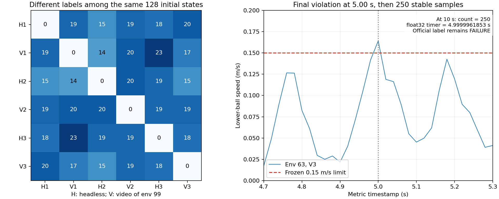

# Microduck Stage 10：第一批重放审查与后续方案

日期：2026-10-01，北京时间。状态：第一批诊断和本次审查完成，Stage 10 尚未结束。本文件是阶段内记录，不是正式结项或训练授权。

## 1. 结论与范围

同一 RTX 5060、同一主检查点、同一组 128 个开发初态，重复执行仍产生标签差异。无视频组内部也有差异，现有证据不能把问题只归因于不同 GPU 或录像。首个控制步的策略动作完全一致，而首个 0.02 s 采样处已记录到状态差异，下一步应向重置、执行器和 0.002 s 物理子步边界定位。

六次回合最后 5 秒内，出现的直接违例只有下球水平速度超过 0.15 m/s。奖励因果关系仍未确定。另有一例独立的浮点计时边界问题，不能据此改写旧标签或解释其余标签变化。

当前没有训练、正式拆板、Stage 03/04 定义修改、奖励修改或约束修改。头部纠偏暂停。允许头部在调整过程中转向；将来的稳定后回正目标需要另行定义，当前不加全程朝前奖励、不锁死头颈。

## 2. 输入与证据核验

- 源码：分支 `double-balance`，提交 `00e34c2038771c5d4ad49fe45dff828c0232e60c`；上传源码归档 SHA256 为 `fa051a71e2a0329cdf80cb125001fffe1b02cc30375e4c2b0db7e55be69103eb`。本次再次核对 101 个冻结运行文件，全部匹配 Stage 09 清单。
- 审查包：`review-20261001T061125Z-75b299-part01.zip`，42,217,433 字节；SHA256 为 `8c5ae3d437f22b685f8b4f528bcaf9939e85c94253ff2b16b54dc629336524f4`。
- ZIP 共 118 个文件，包含清单本身；清单中的 117 项大小、SHA256、路径集合全部通过。
- 6 份评估、15 对差异比较、384,000 个指标采样独立复核通过。每回合均为 500 个控制步、10 秒、零辅助、无物理终止。头部全部初始记录相同；原评估器还逐项核验机器人和双球的根位姿、速度及关节位置、速度与固定初态集合一致。
- 本包含完整 10 秒全环境指标、前 0.2 秒全环境详细记录、env 0/43/99 的完整详细记录。完整 `head-trace.npz` 和 `trace.pt` 仍在本机，本次只接收了这些原始文件的 SHA256 收据，不能声称所有原始轨迹字节已回传。
- 主检查点字节未在本次审查包中重复上传；检查点校验依据运行前后本机校验和六份评估一致的来源记录。

## 3. 六次结果与标签重复性

| 顺序 | 模式 | 旧严格成功数 | 本次开发集比例 |
|---|---|---:|---:|
| 1 | 无视频，第 1 次 | 109/128 | 85.16% |
| 2 | env 99 视频，第 1 次 | 110/128 | 85.94% |
| 3 | 无视频，第 2 次 | 112/128 | 87.50% |
| 4 | env 99 视频，第 2 次 | 110/128 | 85.94% |
| 5 | 无视频，第 3 次 | 109/128 | 85.16% |
| 6 | env 99 视频，第 3 次 | 105/128 | 82.03% |

这是同一组开发初态的重复测量，不合并为 768 次独立试验，不据此替换历史独立严格成功率。

128 个初态中，85 个六次全部成功，2 个六次全部失败（env 66、93），41 个会改变标签。无视频组的两两标签差异为 15、18、19；视频组为 20、17、19。所有组间比较为 14–23 个标签不同。即使两次总成功数相同，样本标签也可不同，例如两次 110/128 的视频运行相差 20 个标签。



15 对运行的首个策略动作向量均完全相同。关节速度等字段在第一个 0.02 s 记录处已有差异；策略动作最早在 0.04 或 0.06 s 出现记录差异。详细字段与原比较报告逐项相符。

这把优先排查范围推向首个控制步内部，但不能精确定位首次分歧子步，也不能直接判定为求解器、TF32 或 GPU 原子操作。固定的根/关节初态集合不包含全部求解器热启动、BAM 电压及负载历史、延迟队列、观测缓存、RNN 状态和 RNG 状态。

运行记录：PyTorch 2.9.1+cu128、mjlab 1.3.0、MuJoCo 3.10.0、mujoco-warp 3.8.1、Warp 1.12.0、rsl-rl-lib 5.0.1；4 个 CPU 线程；矩阵乘法与 cuDNN 的 `fp32_precision=tf32`，`cudnn_benchmark=true`，确定性算法与 cuDNN 确定性选项均为 false。这些是观测到的设置，不是因果实验结果，本阶段未切换这些设置。

## 4. 直接失败条件与计时边界

各运行在 5.02–10.00 s 的最后 250 个采样中，下球速度违例采样数依次为 33、33、34、35、36、39；其余八个门槛均无违例。六份报告中 113 个失败的“运行—初态”记录，其最后一次不稳定采样均由下球速度门槛触发；其中 112 个没有足够的终局连续稳定采样，另 1 个是下面的计时边界。这里的 113 是重复运行记录数，不是 113 个不同初态。

第 6 次运行 env 63：最后一次不稳定采样在 5.00 s；5.02–10.00 s 共 250 个采样连续稳定，采样计数对应 5.00 s；逐步 float32 加法得到 `4.999996185302734`，旧程序按 `< 5.0` 判失败。独立 NumPy float32 递推精确复现所有运行的全部计时值，最大误差为 0。

当前保留官方失败标签。将来若采用整数稳定步计数，应另立验收实现版本、保留原标签并平行报告，须先按用户要求确认 Stage 04 验收修改。不能直接增加 epsilon 或回填本次成功数。

## 5. 视频检查

三段视频均为 1280×720、25 fps、250 帧、10 秒，完整解码通过。每段检查 0.2 秒间隔的 50 个画面及原分辨率终局帧，并与完整 50 Hz 指标交叉核对；这不是每个视频帧的逐帧人工审阅。

可见机械鸭保持直立、双球未出现明显丢失，蓝色托盘仍在承球。头部起始快速转向约 90°，之后保持转向并持续作小幅调整。终局 head_roll 约 25.4°，仍存在略越过模型限位的既有现象；它作为诊断记录保留，不改旧平衡标准，也不在当前阶段加头部惩罚。

| 视频 | env 99 旧标签 | 终局连续稳定计数时间 | 最后一次下球速度违例采样 |
|---|---|---:|---:|
| 第 1 次 | 成功 | 5.26 s | 4.74 s |
| 第 2 次 | 成功 | 5.06 s | 4.94 s |
| 第 3 次 | 成功 | 5.26 s | 4.74 s |

这三段覆盖的是成功样本。env 66、93 的持续失败及 env 63 的边界案例没有对应视频，不能声称已视觉审阅所有失败。单一视角也不能证明具体接触法向、穿透深度或接触力；短时速度超限需依据数值记录。

## 6. 头顶接触与拆板审计

现有编译模型的上球碰撞掩码只允许地面和托盘，无显式接触对。头壳的视觉 geom 与碰撞 geom 分离；本次编译中分别为 48、49，二者均不允许与上球接触。后续实现应按 body、mesh 和碰撞属性唯一定位，不把本次索引写死。

头壳网格有 8,062 个顶点、16,120 个三角面。HOME 包围盒尺寸约为 122.69×91.76×46.34 mm，但这不是可用承球面积。MuJoCo 普通 mesh 碰撞使用凸包；可视三角面、离线重建凸包和实际运行接触需要分别验证。[官方 mesh 文档](https://mujoco.readthedocs.io/en/stable/XMLreference.html#asset-mesh)

对导出的 HOME 网格进行只读几何计算：旧托盘中心投影附近 `(x,y)=(13.84,0) mm`，头壳表面高度约 150.105 mm，离线凸包对应局部斜率约 4.56°。头壳最高点为 154.433 mm，不能拿最高点代替这个位置。源代码记录的旧托盘上表面高度约 156.95 mm，与中心下方头壳相差约 6.85 mm。在 y=±12 mm 附近局部斜率约 8.0°，y=±20 mm 附近约 16.4°。这些是几何检查，不是半径 20 mm 球的实际支承接触解，更不是动态稳定结论。

上球 priority=1，托盘/头壳 priority=0。按动态接触参数合并规则，上球优先级会主导相应接触的 condim、摩擦及求解参数，因此单改头壳摩擦值可能没有预期效果。旧上球接触 condim=4，包含滑动和扭转摩擦，不包含 condim=6 才增加的滚动摩擦维度；第三个摩擦系数有数值不代表滚动阻力已启用。不得在迁移时默默加滚动阻力“帮助”承球。[接触参数规则](https://mujoco.readthedocs.io/en/stable/modeling.html#contact-parameters)；[接触维数](https://mujoco.readthedocs.io/en/stable/computation/index.html#condim)

| 质量项 | 有托盘 | 只移除托盘实体后，解析预期 |
|---|---:|---:|
| 机器人 | 0.75524318 kg | 0.73724318 kg |
| jaw_soft 与托盘的固定组合 | 0.206766 kg | 0.188766 kg |
| 整个双球场景 | 1.38524318 kg | 1.36724318 kg |

机器人减重约 2.38%。jaw+tray 组合质心在 jaw 坐标系内的变化约为 `(-3.373,+0.105,-0.839) mm`；完整旋转及平行轴惯量核算在 JSON 中。托盘的 18 g 在显式 body inertia 中，不能只删除可视/碰撞 geom 就声称已完成减重，也不能从原 jaw_soft 质量里再扣一次。

旧上球接口的以下位置都依赖 `double_balance_tray_frame`：reset、高度零点、actor 六维球状态、critic 九维球状态、上球奖励、相对速度惩罚、托盘倾角、掉球边界、稳定与成功门槛、姿态诊断。actor 总维度为 61、critic 为 85；维度相同不保证观测语义或归一化统计可直接迁移。

另需明确速度语义：现有实现为 `Rᵀ(v_ball−v_site)`，即速度差在托盘轴上的分量；旋转坐标中的位置导数还包含 `−ω_local×r_local`，实际接触点滑移还需要球与头壳两侧角速度及接触点速度。旧定义保持不动；迁移审计应同时记录这几种量，不能把不同的速度语义默认为同一门槛，尤其用户允许头部转向。

## 7. 下一步具体方案

### 7.1 优先：旧任务下的 2 ms 差异定位，零 PPO

先做三次独立进程的短程无视频诊断，仍保持 128 个环境、同一检查点、同一开发初态、原来的 2 ms/20 ms 步长及所有物理和后端设置。详细记录仅覆盖前 0.2 秒，不把短程诊断当作成功率评估。首轮不增加录像条件，也不再机械重复六次总成功数比较。

记录边界为：reset 完成、首个策略调用前后、动作处理后，以及每个物理子步的控制写入前、仿真 step 后和原有 forward 后。采集 qpos/qvel、完整实际控制与执行器输出、BAM 电压/压降/增益/摩擦/上一时刻力矩和延迟状态、接触与求解器热启动/迭代信息、观测和归一化状态、RNN 状态、随机数状态指纹。缺失字段明确记录；不得静默以空数组冒充已经对齐。

观测 hook 不能额外调用策略 forward、reset、sim.forward 或 success；CPU 拷贝会带来同步和时序扰动，需记入限制。保持 128 环境是为了避免单环境批大小改变问题。输出首先回答“首次不同的字段和所处调用边界”，再决定下一项对照。

若动作产生前就不同，优先查重置、状态恢复和观测链；若同一首动作下子步状态不同，优先查 BAM 输入、接触和求解器。只有证据支持时才安排固定动作回放或单独的推理确定性对照；这些均作为诊断条件另记，不混入旧策略成功率。精度、确定性选项、CUDA graph 或求解器选项的实验开关需单列理由和影响，不能作为“修复”悄悄启用。

初始规模：3 次×128 环境×100 个物理子步=38,400 个物理环境子步，对应每次 0.2 秒；本机零 PPO、云 GPU 预算 0。脚本应继续固定源码和输入 SHA、限制自有子进程运行时间、保留原始记录并打包回传。具体 hook 需依据本机已安装依赖源码完成接口检查后交付，不能声称该诊断已经执行。

### 7.2 头顶接触迁移：先提供隔离审计变体，等待物理改动确认

以下是拟议变更与验证设计，尚未实现或运行。按用户“修改 Stage 03/04 前确认”的要求，涉及这些变更时必须先获确认。

| 拟议项 | 具体做法与理由 | 影响及必须核验的内容 |
|---|---|---|
| 碰撞面 | 唯一选中 jaw_soft 上已有 top_head_shell 碰撞 geom，审计实际凸包；只开放上球与该头壳及地面的接触 | 不开放整个机器人或下球；保留头壳原有机器人接触语义；逐帧核验接触对、法向、距离和力 |
| 拆板 | 最终变体移除固定托盘 body、geom 和 18 g 惯量；创建无质量的头顶参考 site | 编译前后质量差严格为 18 g；重新核对组合质心和惯量；不给头顶添加隐藏平板或托举力 |
| 参考系 | 根据实际承球区域与局部表面建立头固连参考系，保留明确的朝前轴标定 | 检查 reset 间隙、球半径补偿、旋转时速度定义、曲面高度和掉球边界 |
| 摩擦 | 第一轮使用已记录的上球有效接触参数，不同时提高摩擦或启用滚动阻力 | 记录实际生成接触的参数；如后续要变更 condim/friction，单独申请并做对照 |
| 接触验证 | 在隔离副本中做球—头壳静态接触与小范围落球/滚动/倾斜测试，再决定是否需要更忠实的接触几何 | 固定头壳的材料/几何试验仅为台架测试，不是无辅助平衡成功；随后才考虑自由整机零 PPO 检查 |
| 任务迁移 | 单独版本迁移六维/九维上球观测、初态、奖励和验收参考系，旧托盘任务与结果完整保留 | 不直接覆盖默认任务；61/85 维之外还需校验语义、尺度和归一化兼容性；允许调整时转头 |

必要时增加“只改变接触面、暂留 18 g 惯性”的诊断对照，以分离几何与减重影响；该对照必须显式标注，不能称为最终无托盘任务。正式无托盘变体仍须真实移除这 18 g。

本阶段不提交训练预算。若后续确需 PPO，须先明确初始化检查点、Adam 恢复/重置、学习率、迭代与课程计数、辅助状态规则、实验更新数和云 GPU 型号/时长，由用户另行确认。

## 8. 保留模型、历史状态与操作协议

主模型继续为 Stage 08 `E/20260929/update_004000.pt`，SHA256：

```text
86d55c3703c18fcf4817db49c6e4dcf839b3f5195d68ae2c559db7e222bded97
```

历史独立严格评估仍为 652/768（84.90%）。Stage 09 四组各保留 500 次新增 PPO，共 2,000 次；F2 断电损失后重做 25 次，实际日志更新和计尝试为 2,025 次；本机新增 PPO 为零。13 个必要检查点、18 份云端评估、10 段 Stage 09 本机视频及 175 项视频审查文件的既有验收记录保留，不重新宣称本次读取了全部检查点字节。

`stage-09-complete` 注释标签仍指向 `9c51a133b40e4342985bab696e54fc02cd45f615`；当前提交 `00e34c2` 是后续文档补充。两者已成功 SSH 推送，不移动标签，不重复完整远端核验。

继续遵循仓库中的：

- `docs/handoffs/microduck-local-ssh-push-protocol.md`
- `docs/handoffs/microduck-cloud-gpu-and-transfer-protocol.md`

固定路径：

```text
仓库：/home/lx/microduck-double-balance/workspace
下载：/home/lx/下载
本批输出：/home/lx/microduck-double-balance/artifacts/double-balance-stage10/replay/20260930T221521Z-e410f3f1
本批诊断脚本：/home/lx/下载/microduck-stage10-diagnostics/microduck-stage10-diagnostics.py
TF32 修复工具：/home/lx/下载/microduck-stage10-tf32-fix.py
```

本机 RTX 5060 仅用于代码、MuJoCo 仿真、推理与视频；不运行 PPO，不重跑 Stage 06 smoke。云 RTX 5090 已由用户确认手动关机，本阶段未连接或操作云端；早期 UNCONFIRMED/PENDING 快照不覆盖后续确认。完整云原始轨迹尚未全部回传，不得删除云端数据。

今后云工作及必要回传 SHA256 核验完成后，立即提醒用户手动关机，提醒时间与实际关机确认分开记录。不自动启动、停止、关闭实例，不运行旧失败自动关机守护。

正式代码与模型归档分支分开，归档分支不合并进 `double-balance`。默认沿用 Git SSH 上传/取文件。阶段结束时在本机创建提交与注释标签，由用户推送：

```bash
cd /home/lx/microduck-double-balance/workspace
git push origin double-balance
# 仅在 Stage 10 真正结项且本地注释标签已创建后：
git push origin stage-10-complete
```

本次尚未创建 Stage 10 结项提交或标签，此处推送命令是后续操作约定，不是现在执行的指令。

## 9. 常见错误与快捷命令

TF32 预检错误已修复：旧工具在项目配置新 API 后读取旧 `allow_tf32` 属性触发冲突。修复改为只读 `fp32_precision`；未修改精度设置或安装依赖。原工具 SHA256 为 `2c8b6c8ff33115ed755e9789e3a0e56002263e34dd725c8ed4b6799286fd1e05`，修复后为 `b6fe8d329f616e63b3e679efc4f58ee96de3aa49022fe2a103575f3719ca6262`。原脚本、计划和失败运行记录保存在输出目录的 `tf32-api-fix-v1/`，迁移收据为 `tf32-api-fix-v1.json`。本次核验计划仅改变了工具 SHA 字段。

第一批已完成，不需要再次运行 `--resume`。若仅需根据本机保留轨迹重建比较和审查包，可使用离线分析入口；它不启动 PPO或新的评估回合：

```bash
python3 '/home/lx/下载/microduck-stage10-diagnostics/microduck-stage10-diagnostics.py' \
  --analyze /home/lx/microduck-double-balance/artifacts/double-balance-stage10/replay/20260930T221521Z-e410f3f1
```

查看原批次状态：

```bash
cat /home/lx/microduck-double-balance/artifacts/double-balance-stage10/replay/20260930T221521Z-e410f3f1/run.json
```

注意：原始 `run.json` 的视频审查 PENDING 是打包时快照；本次新增审查收据记录已经完成的有限范围视频检查，不能覆盖原始文件伪造历史。`PASS` 表示评估程序正常完成；本文件的审查完成也不等于策略目标或 Stage 10 已完成。

下一步首先交付并运行第 7.1 节的旧任务子步诊断；第 7.2 节的物理迁移等待具体确认。阶段结束前仍需整合最终评估、视频审查、必要归档、正式交接以及本机提交/标签。
